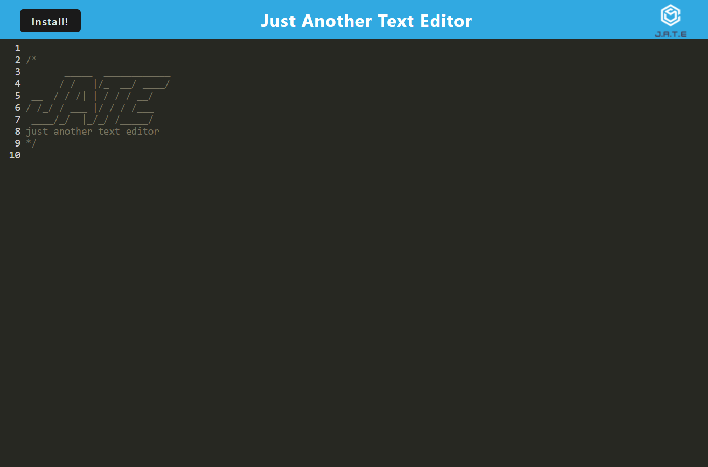

# text-editor

  ## Description:
 a simple text editor that can be used offline and online and be installed on desktop to be used to make code snippets for later use 

  # Table of Contents

   
  - [Installation](#installation)
  - [deployed](#deployed-link)
  - [Usage](#usage)
  - [Credits](#credits)
  - [License](#license)
  - [Contribution](#contributing)
  - [Screenshot](#screenshot)
  - [Contact](#contacts)

  
  ## Installation:

  * run ```npm install``` in terminal to install the dependencies. 
  * run  ```npm run start``` in the terminal.
  * open http://localhost:3000
  

  ## Deployed link
   https://fathomless-headland-52572.herokuapp.com/
  
  ## Technologies
  - JavaScript
  - Nodejs

  ## Usage:

 a text editor for creating snippets

  ## Credits:

  Made by Bader Munir


  ## License:

  For more information about licenses, please visit:

  [License](https://opensource.org/licenses/MIT)


  ## Contributing:
  
  It is open source

  ## Screenshot:

  

  
  ## Contact:

  - [Github Profile](https://github.com/XBaderM)

  - [Email](bader.munir18@googlemail.com)
  
 

